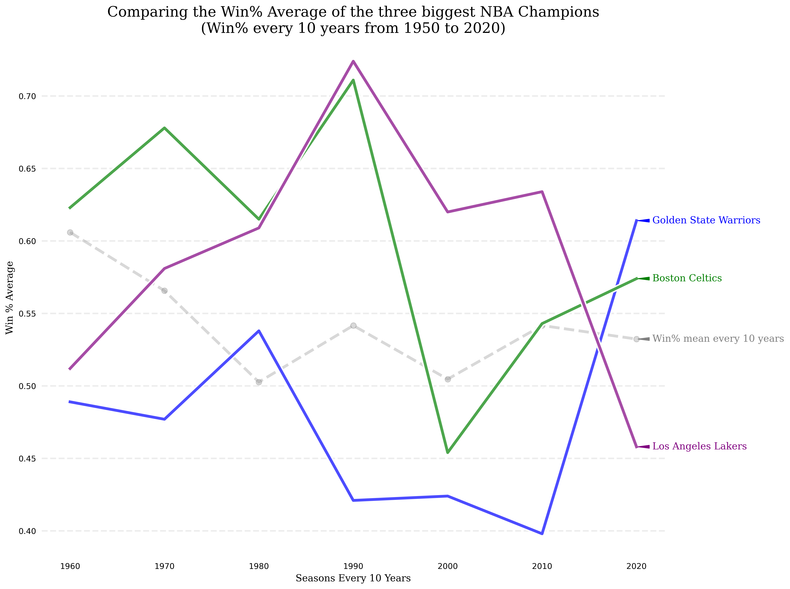

# Comparing NBA Champions Win % over time
The purpose of this iPython Notebook is to make a brief comparison on the three biggest NBA Champions (Los Angeles Lakers, Boston Celtics and Golden State Warriors). I'll be using the Win % over tenths of years, starting from 1950 to 2020.

## And the results are

## Technologies Used in this analysis
- Python, 
- Jupyter Notebook, 
- Pandas, 
- Numpy,
- Matplotlib
